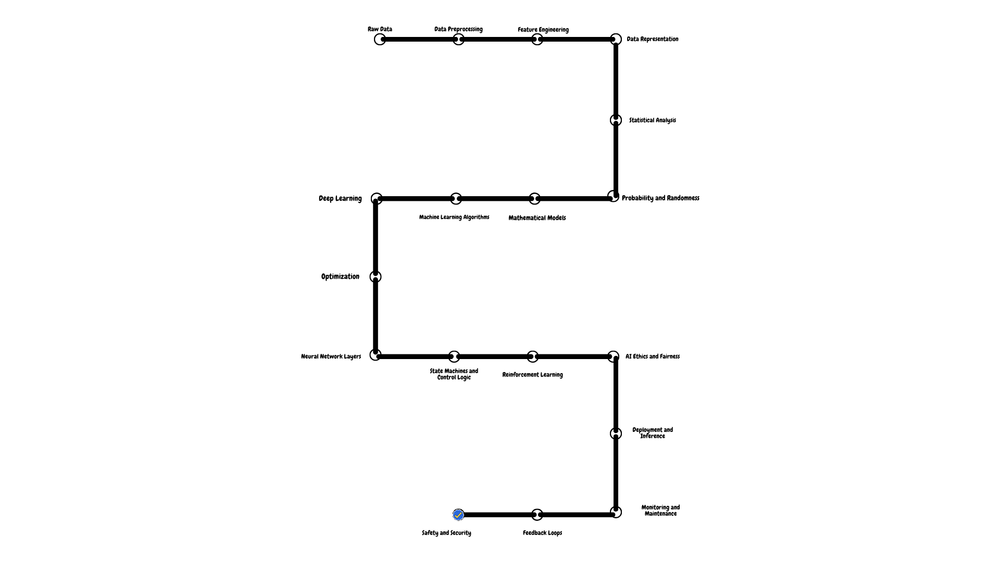

1. **Raw Data:**
   - Raw data encompasses the initial information collected, which can include numerical data, text, images, audio, video, or any other form of data relevant to the problem at hand.

2. **Data Preprocessing:**
   - Data preprocessing includes data cleaning, where missing values are handled, duplicates are removed, and outliers are identified and managed. It also involves data transformation, which can include scaling, normalization, and encoding categorical variables.

3. **Feature Engineering:**
   - Feature engineering is the process of creating new features or transforming existing ones to make them suitable for machine learning algorithms. It often involves domain knowledge and creativity to extract meaningful information from the data.

4. **Data Representation:**
   - Data representation defines how data is structured and presented for analysis. This can include vectorization of text data, image resizing, and encoding schemes for various types of data.

5. **Statistical Analysis:**
   - Statistical analysis involves descriptive statistics (mean, median, standard deviation) and inferential statistics (hypothesis testing, confidence intervals) to gain insights into data distributions, relationships, and patterns.

6. **Probability and Randomness:**
   - Probability theory introduces concepts like random variables, probability distributions, and conditional probabilities. Randomness is essential for modeling uncertainty and variability in real-world data.

7. **Mathematical Models:**
   - Mathematical models provide a formal representation of relationships between variables. Linear regression, for instance, models a linear relationship between input features and output predictions.

8. **Machine Learning Algorithms:**
   - Machine learning algorithms encompass a wide range of techniques, including supervised learning (classification, regression), unsupervised learning (clustering, dimensionality reduction), and reinforcement learning (sequential decision-making).

9. **Deep Learning:**
   - Deep learning abstracts complex neural network architectures, including convolutional neural networks (CNNs) for image processing and recurrent neural networks (RNNs) for sequential data.

10. **Optimization:**
    - Optimization techniques like gradient descent are used to find the best model parameters by minimizing a loss function. It involves finding the optimal solution in a parameter space.

11. **Neural Network Layers:**
    - Different types of layers in neural networks, such as convolutional layers for feature extraction in images or attention layers for sequence modeling, abstract specific data processing operations.

12. **State Machines and Control Logic:**
    - State machines and control logic define how AI systems make decisions based on internal states, inputs, and transitions. It's essential for tasks like autonomous driving or robot control.

13. **Reinforcement Learning:**
    - In reinforcement learning, agents interact with environments, learning optimal policies through state transitions and rewards. Markov decision processes (MDPs) and Q-learning are often used abstractions.

14. **AI Ethics and Fairness:**
    - This abstraction layer involves principles and guidelines to ensure AI systems are developed and used ethically, addressing issues like bias, fairness, transparency, and accountability.

15. **Explainability and Interpretability:**
    - Techniques for model explainability abstract how black-box AI models can be understood and interpreted, providing insights into their behavior.

16. **Deployment and Inference:**
    - Deployment involves abstracting the integration of AI models into real-world applications, ensuring they function effectively and securely.

17. **Monitoring and Maintenance:**
    - This layer abstracts the ongoing monitoring and maintenance of AI systems to address issues like concept drift, model decay, and performance degradation.

18. **Feedback Loops:**
    - Feedback loops introduce continuous learning and adaptation, enabling AI systems to improve over time based on user feedback and changing environments.

19. **Safety and Security:**
    - Abstraction at this layer encompasses security measures to protect AI systems from adversarial attacks and ensure their safe operation.

20. **Scalability and Distributed Systems:**
    - In distributed AI systems, abstraction covers how AI computations are distributed across multiple nodes and scaled for efficiency.
